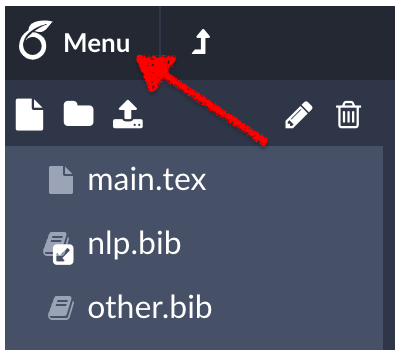
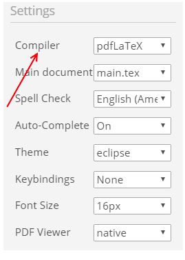

### Changing Compiler from Overleaf

- Sometimes for certain languages, classes and packages it may be necessary to use a different compiler like `xelatex` than the default pdflatex. We have to set XeLatex instead of PdfLatex for writing Bangla (from [Rajan-sust's repo](https://github.com/Rajan-sust/Bangla-in-Latex-with-Overleaf)
- To change the compiler, simply click into the left hand menu 

- Click on the Compiler menu under Settings 

### TODO: will add more features (work-in-progress)